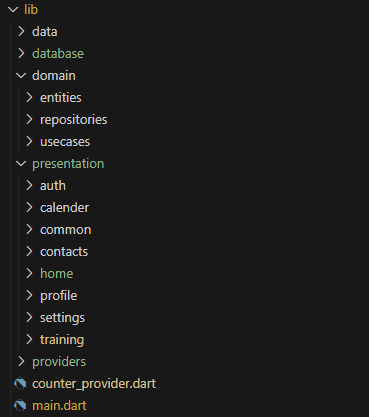
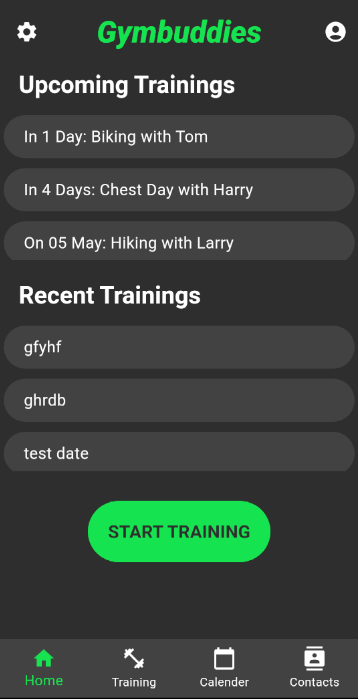
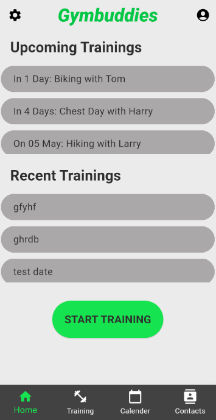
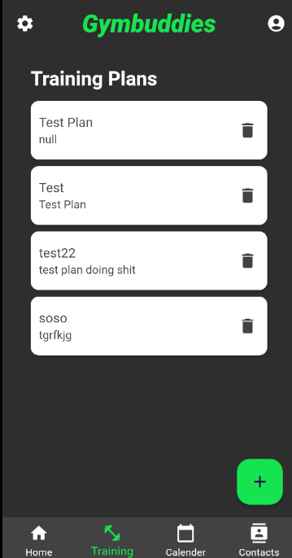
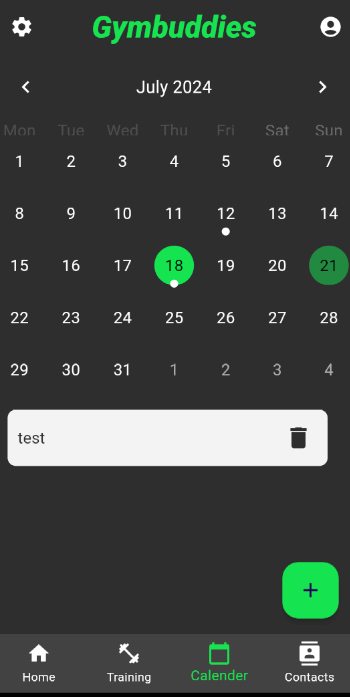
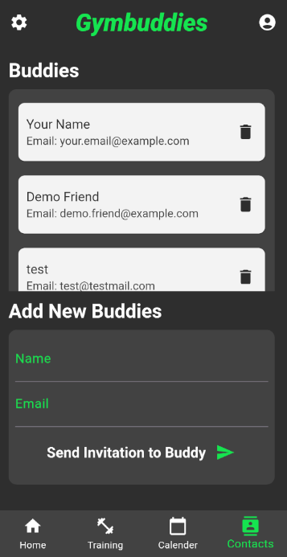
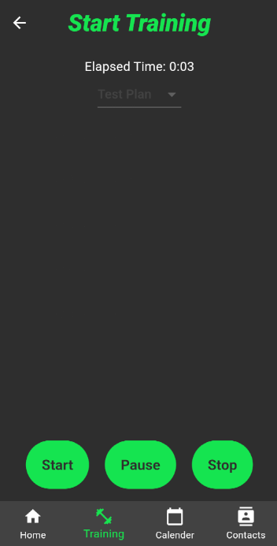
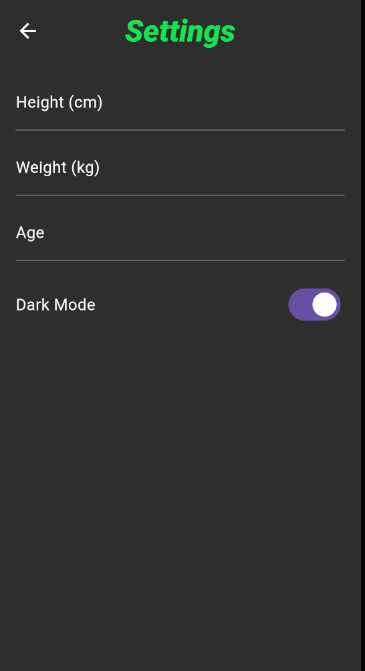
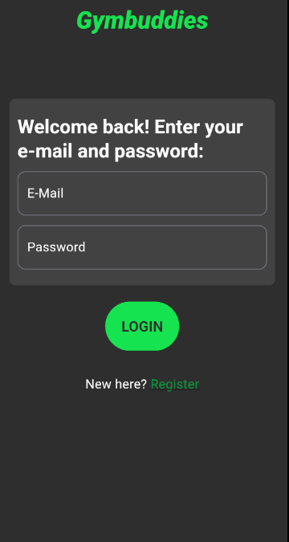

# Gymbuddies

## Abstract

Gymbuddies is an innovative fitness app designed to help users create training plans, track their progress, schedule training sessions, and connect with friends to plan and train together. The app offers a comprehensive suite of tools for fitness enthusiasts to stay motivated and achieve their fitness goals.

## Detailed Description

Gymbuddies is a versatile fitness application tailored to meet the needs of individuals who are passionate about maintaining a healthy lifestyle and enjoy working out with friends. The app provides a robust platform for creating personalized training plans, tracking workout progress, scheduling training sessions in a calendar, and fostering a community of fitness buddies for mutual motivation and support.

## Problem Solved

The primary problem Gymbuddies addresses is the lack of organization and social interaction in personal fitness routines. Many fitness enthusiasts struggle to maintain consistency in their workouts due to a lack of structured planning and accountability. Gymbuddies solves this by offering tools for meticulous planning and the ability to connect with friends for joint training sessions, thereby enhancing motivation and commitment.

## Target Persona
### Persona: Get Fit, Get Social: Gymbuddies, where buddies become gains!


- Age: 18-40 years
- Occupation: Students, Professional athletes
- Goals: Maintain a regular workout routine, track progress, stay motivated through social interaction
- Pain Points: Difficulty in planning workouts, lack of motivation, inability to find workout partners
- Benefits from the App:
    - Ability to create and customize training plans
    - Track and monitor workout progress
    - Schedule training sessions in a calendar
    - Connect and plan workouts with friends
    - Receive notifications and reminders for scheduled workouts

## Screens and Main Functionalities

### Home Page

- Functionality: Displays upcoming and recent training sessions, providing an overview of the user's workout schedule and history.
- Posibility to start a new training.

### Training Plan Page

- Functionality: Allows users to create training plans, offering a structured approach to their workouts.

### Calendar Page

- Functionality: Enables users to schedule new training sessions and view their workout calendar, ensuring they stay organized.

### Contacts Page

- Functionality: Users can add new friends to their contacts and plan joint training sessions, fostering a community aspect.

### Settings Page

- Functionality: Provides options to customize the app settings, including theme and other preferences.

### Profile Page

- Functionality: Users can view and edit their profile information, and manage their account details.

### Login and Register Pages

- Functionality: Facilitates user authentication, allowing new users to sign up and existing users to log in to their accounts.

## Architecture

Gymbuddies follows a layered architecture to ensure separation of concerns and modularity. The primary layers include:

### Model

- Defines the data structures and models used throughout the app, representing the core entities such as User, TrainingPlan, and Session.

### Business Logic

- Contains the business rules and logic that govern how the data is processed and manipulated. This layer ensures the application's functionality aligns with the business requirements.

### View

- Manages the UI components, rendering the data to the user and handling user interactions. This layer ensures a smooth and intuitive user experience.

### Services

- Handles external interactions, such as database access, network requests, and third-party API integrations. This layer abstracts the data access and communication logic.

## Other criteria covered

Linter Rules:

- Utilization of linter rules ensures code consistency and quality. Linter rules have been applied in GymBuddies.

Stricter Type Checks:

- By using Dart's type system and avoiding dynamic types, stricter type checks have been implemented.

Stateful Widgets for Ephemeral State:

- Ephemeral state, which is short-lived and not needed across widget boundaries, is managed with stateful widgets.

Composition over Inheritance:

- Composition is preferred over inheritance in many areas to create more flexible and reusable code structures.

Centralized Navigation Logic:

- Navigation logic is centralized and used by various parts of the app.

Typed Routes over Untyped Routes:

- Typed routes are preferred for type safety and error prevention.

Separation of Concerns:

- Clear separation of model, business logic, and view is maintained to improve the app's maintainability and extensibility.

Layer-Specific Models:

- Each layer (model, business logic, view) defines its own models to clearly separate responsibilities.

Abstraction of Non-Integral Dependencies:

- Dependencies, such as translation and state management, are abstracted through interfaces for easier interchangeability and testability.

Data Persistence Solution:

- A data persistence solution (e.g., SQLite) is implemented for local data storage when necessary.

Avoidance of Dynamic Types:

- Specific types are used instead of dynamic to enhance type safety and code quality.

No Hardcoded Strings in Widgets:

- Strings are managed in separate files (e.g., through internationalization) to avoid hardcoding.

Avoidance of Hardcoded Data:

- External data sources or configuration files are used instead of hardcoded data.

Avoidance of "Magic Numbers" or Unclear Constants:

- Magic numbers are replaced with named constants to make the code more readable and understandable.

Reliable State Management:

- State management (e.g., using Riverpod) is implemented to ensure consistent and reliable data management.

Proper Resource Disposal:

- Resources such as streams and controllers are properly disposed of to avoid memory leaks.

Avoidance of Code Duplication:

- Logical abstraction and code reuse are employed to minimize code duplication.

Avoidance of Hardcoded Colors and Font Sizes:

- Colors and font sizes are defined through thematic configurations rather than hardcoding.

Adherence to Software Principles (KISS, DRY, YAGNI, SOLID):

- These principles are adhered to for writing clean and maintainable code.

Error Handling and Exception Management:

- Mechanisms for error handling and exception management are implemented to avoid and manage unforeseen issues.

Graceful Error Handling:

- The app is designed to not crash and to display appropriate error messages when an error occurs.

Compile-Time Error Prevention:

- Runtime errors are minimized by using type checks and other compile-time constructs.

## Architecture Diagram

```
+-------------------+
|      View         |
| (Flutter Widgets) |
+--------+----------+
         |
         |
+--------+----------+
|   Business Logic  |
|(Provider,Riverpod)|
+--------+----------+
         |
         |
+--------+----------+
|      Model        |
|  (Data Classes)   |
+--------+----------+
         |
         |
+--------+----------+
|     Services      |
|  (Database, API)  |
+-------------------+
```

## File Structure



By structuring the project in this manner, Gymbuddies maintains a clean separation of concerns, making it easier to manage, scale, and test the application. The use of Riverpod for state management ensures that the application state is handled efficiently and reactively.

## Pages

Home Page:



Home Page White Mode:



Training Plans:



Calendar:



Contacts:



Training:



Settings:



Profile:


Login:



Register:


## Credits

This app is designed and developed as part of the lectures on mobile applications at the HTWG Konstanz.

### By 

Stefan Ptacek, Julian Klimek
