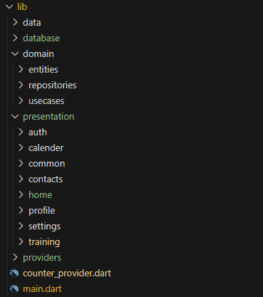
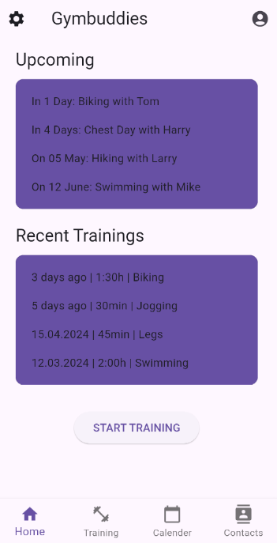
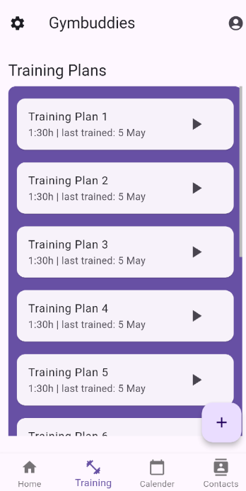
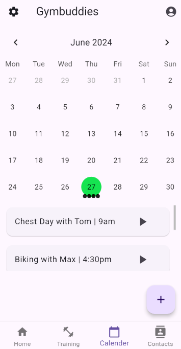
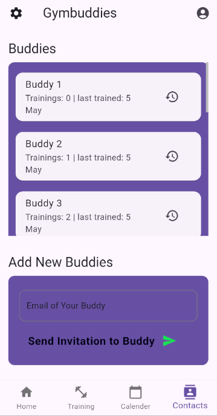
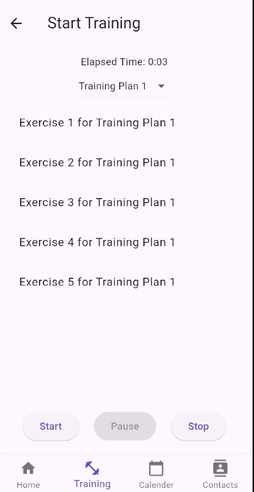
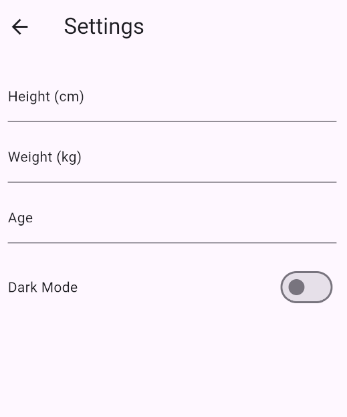
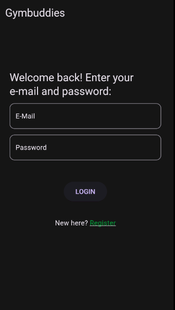
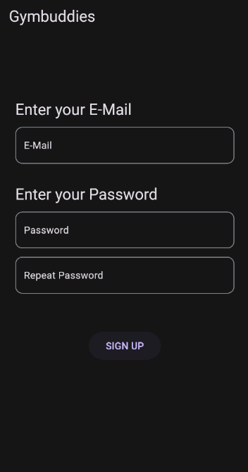

# Gymbuddies

## Abstract

Gymbuddies is an innovative fitness app designed to help users create training plans, track their progress, schedule training sessions, and connect with friends to plan and train together. The app offers a comprehensive suite of tools for fitness enthusiasts to stay motivated and achieve their fitness goals.

## Detailed Description

Gymbuddies is a versatile fitness application tailored to meet the needs of individuals who are passionate about maintaining a healthy lifestyle and enjoy working out with friends. The app provides a robust platform for creating personalized training plans, tracking workout progress, scheduling training sessions in a calendar, and fostering a community of fitness buddies for mutual motivation and support.

## Problem Solved

The primary problem Gymbuddies addresses is the lack of organization and social interaction in personal fitness routines. Many fitness enthusiasts struggle to maintain consistency in their workouts due to a lack of structured planning and accountability. Gymbuddies solves this by offering tools for meticulous planning and the ability to connect with friends for joint training sessions, thereby enhancing motivation and commitment.

## Target Persona
### Persona: Get Fit, Get Social: Gymbuddies, where buddies become gains!


- Age: 18-40 years
- Occupation: Students, Professional athletes
- Goals: Maintain a regular workout routine, track progress, stay motivated through social interaction
- Pain Points: Difficulty in planning workouts, lack of motivation, inability to find workout partners
- Benefits from the App:
    - Ability to create and customize training plans
    - Track and monitor workout progress
    - Schedule training sessions in a calendar
    - Connect and plan workouts with friends
    - Receive notifications and reminders for scheduled workouts

## Screens and Main Functionalities

### Home Page

- Functionality: Displays upcoming and recent training sessions, providing an overview of the user's workout schedule and history.

### Training Plan Page

- Functionality: Allows users to create and start training plans, offering a structured approach to their workouts.

### Calendar Page

- Functionality: Enables users to schedule new training sessions and view their workout calendar, ensuring they stay organized.

### Contacts Page

- Functionality: Users can add new friends to their contacts and plan joint training sessions, fostering a community aspect.

### Settings Page

- Functionality: Provides options to customize the app settings, including theme, notifications, and other preferences.

### Profile Page

- Functionality: Users can view and edit their profile information, track their fitness progress, and manage their account details.

### Login and Register Pages

- Functionality: Facilitates user authentication, allowing new users to sign up and existing users to log in to their accounts.

## Architecture

Gymbuddies follows a layered architecture to ensure separation of concerns and modularity. The primary layers include:

### Model

- Responsibility: Defines the data structures and models used throughout the app, representing the core entities such as User, TrainingPlan, and Session.

### Business Logic

- Responsibility: Contains the business rules and logic that govern how the data is processed and manipulated. This layer ensures the application's functionality aligns with the business requirements.

### View

- Responsibility: Manages the UI components, rendering the data to the user and handling user interactions. This layer ensures a smooth and intuitive user experience.

### Services

- Responsibility: Handles external interactions, such as database access, network requests, and third-party API integrations. This layer abstracts the data access and communication logic.

## Architecture Diagram

```
+-------------------+
|      View         |
| (Flutter Widgets) |
+--------+----------+
         |
         |
+--------+----------+
|   Business Logic  |
|(Provider,Riverpod)|
+--------+----------+
         |
         |
+--------+----------+
|      Model        |
|  (Data Classes)   |
+--------+----------+
         |
         |
+--------+----------+
|     Services      |
|  (Database, API)  |
+-------------------+
```

## File Structure



By structuring the project in this manner, Gymbuddies maintains a clean separation of concerns, making it easier to manage, scale, and test the application. The use of Riverpod for state management ensures that the application state is handled efficiently and reactively.

## Pages


















This app is designed and developed as part of the lectures on mobile applications at the HTWG Konstanz.
